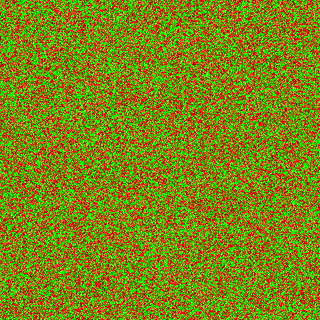

### For more information about the result and the whole process check out the [pdf][1] and the code documentation especially in **version 3**

**In order to run the code you will need to have a GPU that supports cuda!**
Cuda installation and setup in visual studio [Guide][2]

__About Demo:__
Concerning this section we use the previously constructed engine in cuda (v3) and the c++ library SFML
in order to visualize the results and observe the evolution process of the model.
In order to edit the Demo.cu file in visual studio and have a succesfull run you will have also to download
and link SFML [Guide][3]

__Running the Demo:__
  1. Press i in order to Import
  2. Press b in order to Begin the updates
  3. Press f in order to stop
  4. Press in the window the left mouse in order to draw a red line
  5. Press in the window the right mouse in order to draw a green line
  6. Press esc to exit the program

__About Data:__
This folder contains the multiple pre calculated states of the model in order to validate our programs.
The number declares the number of updates from the initial state <conf-init.bin>.

[1]: https://github.com/eurichon/ISING-MODEL-IN-CUDA/blob/master/Report.pdf
[2]: https://www.youtube.com/watch?v=cuCWbztXk4Y
[3]: https://www.sfml-dev.org/tutorials/2.5/start-vc.php

For any issue or difficulty running send me an email: eurichon1996@gmail.com , papachri@auth.ece.gr
